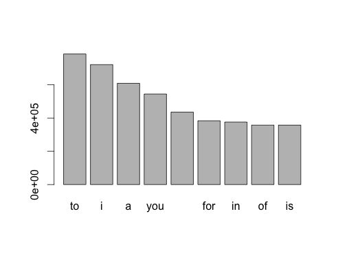
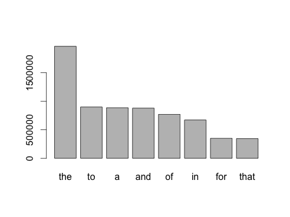
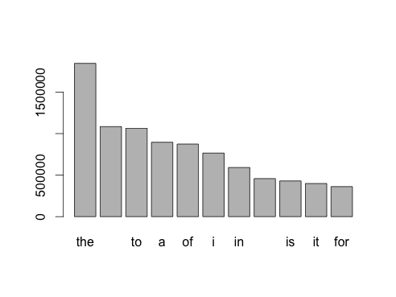

---
title: "MileStone Report"
author: "Chia-Ching Chou"
date: "March 27, 2015"
output:
  html_document:
    keep_md: yes
---    
System Mac OSX 10.10.2 4G RAM. Core i5 1.7GHz
R studio 0.98.994 

The code use to make figs and input data can be found here:


# Introduction
This is report for Capstone Project. In this project, I demonstrate that I've downloaded the data and have successfully loaded it in. I also create a basic report of summary statistics about the data sets, and report interesting findings that I amassed so far. I will make a plan for creating a prediction algorithm and Shiny app, and I would like your feedback in this plan.
(Most of the R code will not show up in this report, but you can find them in my github account. )

# Data Collection
Three text files are collected from twitter, news, and blogs. This data are download from Coursera Capston website. In this report, I use English data set. 


# Data Preview
The Firs Step to begin is to know how many lines, words, and size of each data. This will help to decide how much information I will need to extract out from data set. Working on over size data will crash my computer, and working on not enough data will give wrong information.

Bellow, I use system command "wc" to get information of each file in lines, words, and file size. (When I direct use system() in the code, the markdown will halt in process. So I assign the "wc" output result to each vector. This is just for report. )
```{r}
#twitter <- system('wc -lwm final/en_US/en_US.twitter.txt',intern = T)
twitter  <-"2360148 30373603 166816544 final/en_US/en_US.twitter.txt"
# news <- system('wc -lwm final/en_US/en_US.news.txt',intern = T)
news <- "1010242 34372530 205243643 final/en_US/en_US.news.txt"
# blogs <- system('wc -lwm final/en_US/en_US.blogs.txt',intern = T)
blogs <- "899288 37334147 208623081 final/en_US/en_US.blogs.txt"
tSummary <- as.numeric(grep('[[:digit:]]', unlist(strsplit(twitter," ")), value = T))
nSummary <- as.numeric(grep('[[:digit:]]', unlist(strsplit(news," ")), value = T))
bSummary <- as.numeric(grep('[[:digit:]]', unlist(strsplit(blogs," ")), value = T))
tableSummary <- as.data.frame(rbind(tSummary,nSummary,bSummary))
rownames(tableSummary)<- c("twitter","news","blogs")
colnames(tableSummary)<- c("line","words","size")
```

## Summary table for each data set 

```{r}
print(tableSummary)
```
Next, I will use readLines() to get each date set into R for Data Transform.
Because each file is very large. I will need to process one by one. 


# Data Transform
Before I can analysis the text in each file. I will need to sperate non-text character from text character. Therefor I put a "{ }" to non-text character first, then split text with "{ }". The detials of the example process in twitter text list below.
First, put { } around non-text characters, and assign to vector twitterText.
Second, remove twitter from memory, to light the loading of computer.
Third, change all text to low case.
Forth, split string text by  "{ }".
Fifth, unlist each element in the vector.
The example code is here: 

#### (I did not run the code with markdown file. It took to much time to complete.)
```{r}
# twitterText <- gsub("(\\.|\\,|\\?|\\!|\\;|\\&|\\(|\\)|\\:|[\"]|\\-\\-|\\=| \\- |\\#| \\'|\\' )","{\\1}",twitter)
# rm(twitter)
# twitterText <- tolower(twitterText)
# twitterTokens <- strsplit(twitterText,"\\{.?}| ")
# twitterTokens <- unlist(twitterTokens)
```
This data transform is Tokenization. 
I repeat this with news and blog text.

### A Summary of tokenization files.

```{r}
#twitterT<-length(twitterTokens)
twitterT <- c(35261564)
#newsT <- length(newsTokens)
newsT <- c(38803501)
#blogsT <- length(blogsTokens)
blogsT <- c(41609972)
# typeOfwordsT <- length(twitterTokenCount)
typeOfwordsT <- c(524166)
# typeOfwordsN <- length(newsTokenCount)
typeOfwordsN <- c(425176)
# typeOfwordsB <- length(blogsTokenCount)
typeOfwordsB <- c(540783)
rT <- round(c(twitterT/typeOfwordsT))
rN <- round(c(newsT/typeOfwordsN))
rB <- round(c(blogsT/typeOfwordsB))
tokenSummary<- as.data.frame(rbind(twitterT,newsT,blogsT))
wordSummary<- as.data.frame(rbind(typeOfwordsT,typeOfwordsN,typeOfwordsB))
repeatToken <- as.data.frame(rbind(rT,rN,rB))
totalSummary <- as.data.frame(cbind(tokenSummary[,1],wordSummary[,1],repeatToken[,1]))
rownames(totalSummary)<- c("twitter","news","blogs")
colnames(totalSummary)<- c("tokensNo","wordsNo","repeatToken")


```

# Exploratory analysis
After tokenization each file, I compare the total number of tokens in each file. I also look the type of words in each files. By dive tatal tokens with words type, we can see the possible repeats of each token in each file's token population.
```{r}
print(totalSummary)
```
In the summary table, we see the news file have less tokens than blogs, and less words in all three files. By dive tokenNo/wordsNo, we can see the news may have higher repeats in the tokens. In the other hand, the twitter has lowest repeat of tokens. It may imply the diversity of words use in twitter than news.

### High counting words
The possible repeat of each tokens does not give me enough information to think 
what I can use to make a app to predict next input word from typing few texts. So I decide to look the Highest counting words in each files.

Here are barplot to show the word counting bigger than 300000

### Twitter


### News


### Blogs


In this barplot, I can see the news and blogs has similar high counting word, but twitter is little different from others.

# Summary
1. Here I find the twitter has different words counting and repeats. When I develop a app to predict next word, I think it is better to have different method or parameters for twitter prediction. 
2. Because the text file is so big. Maybe I can just use one third of text to build algorithm.
3. I maybe able to put News and Blogs together, since they has similar high counting words.
4. The high counting word seems not prove any sentence purpose, so next I will look the words associate with this high counting words, as my method to make bigram tokenization.


```{r, echo=FALSE}

```

