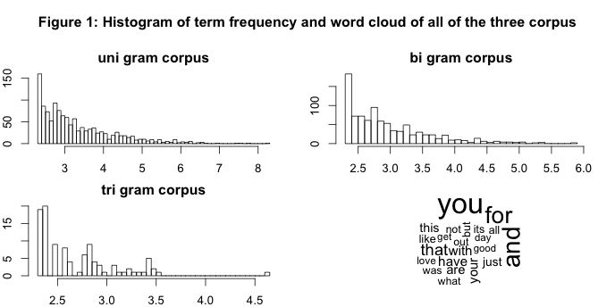

# NLP Milestone  report
Chia-Ching Chou  
March 23, 2015  

This is an R Markdown document. Markdown is a simple formatting syntax for authoring HTML, PDF, and MS Word documents. For more details on using R Markdown see <http://rmarkdown.rstudio.com>.

When you click the **Knit** button a document will be generated that includes both content as well as the output of any embedded R code chunks within the document. You can embed an R code chunk like this:


```r
library(knitr)
```

```
## Warning: package 'knitr' was built under R version 3.1.2
```

```r
#twitter <- system('wc -lwm final/en_US/en_US.twitter.txt',intern = T)
twitter  <-"2360148 30373603 166816544 final/en_US/en_US.twitter.txt"
```
wc is system commond
Using system() to run system commond. -lwm is for wc. it mean length, word counts, and size (m? not sure)

```r
# news <- system('wc -lwm final/en_US/en_US.news.txt',intern = T)
news <- "1010242 34372530 205243643 final/en_US/en_US.news.txt"
# blogs <- system('wc -lwm final/en_US/en_US.blogs.txt',intern = T)
blogs <- "899288 37334147 208623081 final/en_US/en_US.blogs.txt"
ten <- as.numeric(grep('[[:digit:]]', unlist(strsplit(twitter," ")), value = T))

# sten <- as.list(ten)
```
twitter = " 2360148 30373603 166816544 final/en_US/en_US.twitter.txt"
split the elements of a character by " " in twitter and unlist it.
Use grep to find digits ( number in txt) and change to numbers

```r
nen <- as.numeric(grep('[[:digit:]]', unlist(strsplit(news," ")), value = T))

# snen <- as.list(nen)
ben <- as.numeric(grep('[[:digit:]]', unlist(strsplit(blogs," ")), value = T))

# sben <- as.list(ben)
en <- as.data.frame(rbind(ten,nen,ben))
rownames(en)<- c("twitter","news","blogs")
#colnames(en, do.NULL = FALSE)
# str(en)
colnames(en)<- c("line","words","size")

print(en)
```

```
##            line    words      size
## twitter 2360148 30373603 166816544
## news    1010242 34372530 205243643
## blogs    899288 37334147 208623081
```

I can find what is wrong with Knit. But the r program run just fine.
So I have the kable() result here.


Here is error message after I run knit from R-studio:

Quitting from lines 29-36 (MileStoneReport.Rmd) 
Error in `colnames<-`(`*tmp*`, value = c("line_counts", "word_counts",  : 
  'names' attribute [3] must be the same length as the vector [0]
Calls: <Anonymous> ... withCallingHandlers -> withVisible -> eval -> eval -> colnames<-
Execution halted

You can also embed plots, for example:

```
## Warning: package 'RWeka' was built under R version 3.1.2
```

```
## Warning: package 'RWekajars' was built under R version 3.1.2
```


```r
# options(mc.cores=1)

BigramTokenizer <- function(x) {RWeka::NGramTokenizer(x, RWeka::Weka_control(min = 2, max = 2))}
ctrl2 <- list(tokenize = BigramTokenizer, bounds = list(global = c(10,Inf)))

TrigramTokenizer <- function(x) {RWeka::NGramTokenizer(x, RWeka::Weka_control(min = 3, max = 3))}
ctrl3 <- list(tokenize = TrigramTokenizer, bounds = list(global = c(10,Inf)))

# TeragramTokenizer <- function(x) {RWeka::NGramTokenizer(x, RWeka::Weka_control(min = 4, max = 4))}
# ctrl4 <- list(tokenize = TeragramTokenizer, bounds = list(global = c(10,Inf)))

#Tokenizer <- function(x) {RWeka::NGramTokenizer(x, RWeka::Weka_control(min = 1, max = 3))}
#ctrl0 <- list(tokenize = Tokenizer, bounds = list(global = c(10,Inf)))

#library(slam)
#en.tdm <- TermDocumentMatrix(enall,control = ctrl)
#en.bitdm <- TermDocumentMatrix(enall,control = ctrl2)
#en.tritdm <- TermDocumentMatrix(enall,control = ctrl3)
# en.teratdm <- TermDocumentMatrix(enall,control = ctrl4)
#en.tdm0 <- TermDocumentMatrix(enall,control = ctrl0)

#freq <- rowapply_simple_triplet_matrix(en.tdm,sum)
#freqbi <- rowapply_simple_triplet_matrix(en.bitdm,sum)
#freqtri <- rowapply_simple_triplet_matrix(en.tritdm,sum)
# freqtera <- rowapply_simple_triplet_matrix(en.teratdm,sum)
#freq0 <- rowapply_simple_triplet_matrix(en.tdm0,sum)
```



